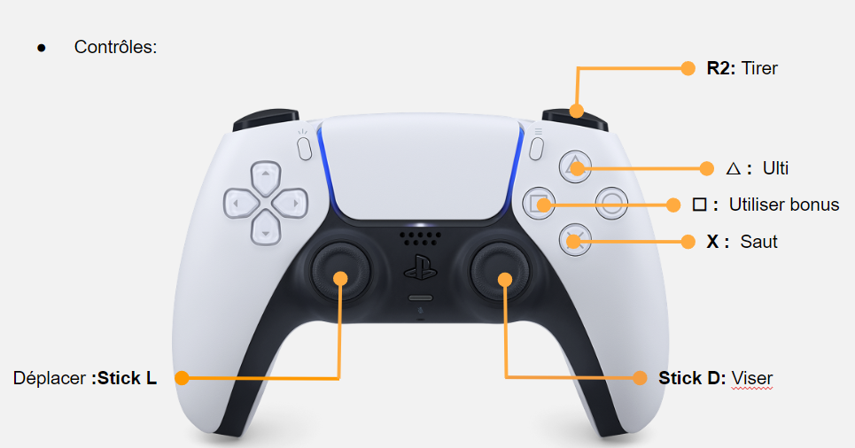
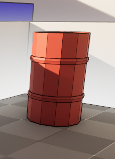
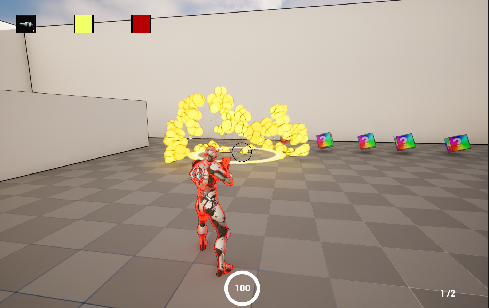
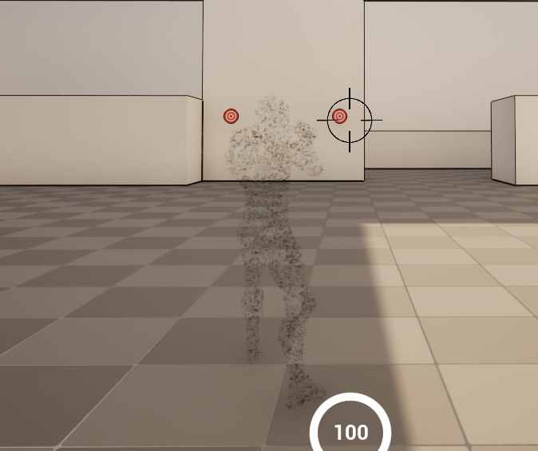

# Death rocket

## Summary

- [Death rocket](#death-rocket)
  - [Summary](#summary)
  - [Contributors](#contributors)
  - [Concept](#concept)
  - [Controls](#controls)
- [Features](#features)
  - [Rocket](#rocket)
  - [Ult](#ult)
  - [Items](#items)
- [Screenshots](#screenshots)

## Contributors

- [Felix](https://gitlabstudents.isartintra.com/f.becaud)
- [Gabriel](https://gitlabstudents.isartintra.com/g.bon)
- [Paul](https://gitlabstudents.isartintra.com/p.bussy)
- [Yohann](https://gitlabstudents.isartintra.com/y.demaisonregne)
  
## Concept

A multiplayer death match game where you use rockets to kill your opponent(s).

## Controls

# Features

## Rocket

You can shoot a basic rocket to your opponent, if they are directly touched they'll die but if they are touched by the explosion that happens when a rocket hits something they'll only take one damage, knowing that a player has 2 HP. If they are in the deflagration of the explosion, they'll just be blown away.

## Ult 

You have an ultimate ability, which can be triggered once your bar (at the bottom of the screen) is charged at 100%. You have to press ▲ to activate your ultimate. Once you press it your bar will be put at 0%. There are 4 Ultimates :
- Invincible\
    You can't take any damage
- Invisible\
    You are invisible to your opponent
- NoReload\
    You don't have to reload to shoot
- OverDrive\
    You can't get hurt by your own rockets, a direct hit won't kill you and your reload will be halved

## Items

- Implosive rocket\
  After explosion, attracts anything inside the purple radius.

- Triple Rocket\
  Shoots three rockets at an angle of -10, 0 and 10 degrees.

- Mine\
  First stick to the surface it lands on, then explode if anyone approches it. Launcher can exit the radius if they's in it at landing.

  
- Homing Rocket\
    Whenever an enemy enters the detection zone, the rocket starts following them.\

- Barrel\
    Explodes when hit causing an explosion or an implosion.

    

# Screenshots
  
  